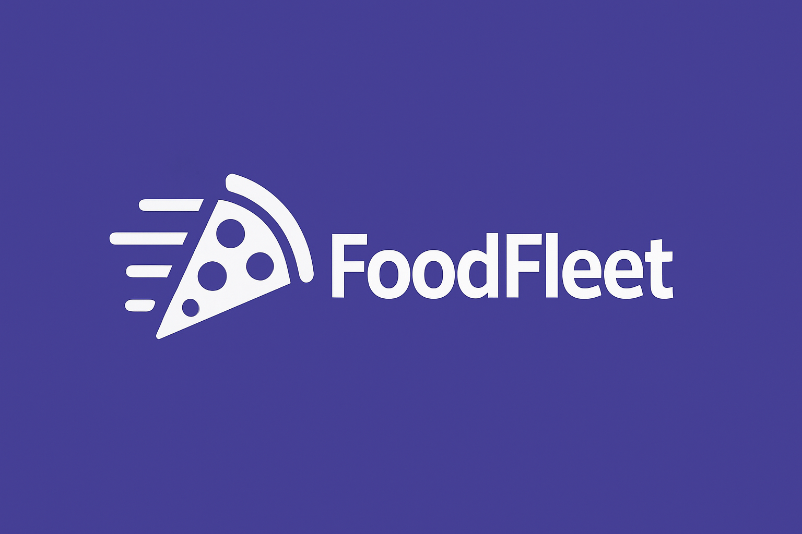

# 🚀 FoodFleet

<div align="center">
  
  
  
  
  
  
  
  
  
  
  
  
  
  
  
  
  **Современная мультиплатформенная система для управления сервисами доставки еды**
</div>

> ⚠️Примечание: Этот проект вымышленный. Он создан исключительно для учебных целей.

## 📱 Структура проекта

FoodFleet — это монорепозиторий на базе Nx, включающий следующие приложения:

```
foodfleet/
├─ apps/
│  ├─ backend/     # Python backend API
│  ├─ landing/     # Next.js landing page
│  ├─ mobile/      # React Native mobile app
```

## 🛠️ Технологии

- **Frontend**: React, Next.js, TypeScript
- **Mobile**: React Native, Expo
- **Backend**: Python, FastAPI, Redis
- **DevOps**: NX монорепозиторий, Docker, CI/CD с GitHub Actions
- **Тестирование**: Jest, Cypress

## ⚡ Быстрый старт

### Предварительные требования

- Node.js (v18+)
- npm или pnpm
- Python 3.9+

### Установка

```bash
# Клонировать репозиторий
git clone https://github.com/vaces8v/foodfleet.git
cd foodfleet

# Установить зависимости
npm install
```

## 🚀 Запуск приложений

### Landing (Next.js)

```bash
npx nx serve landing
```

Приложение будет доступно по адресу: http://localhost:4200

### Mobile (Expo)

```bash
npx nx run mobile:start
```

### Backend (Python)

```bash
npx nx serve backend
```

API будет доступно по адресу: http://localhost:8000

## 🧪 Запуск тестов

```bash
# Запуск всех тестов
npx nx run-many -t test

# Запуск тестов для конкретного приложения
npx nx test landing
npx nx test mobile
```

## 📊 Статус CI/CD

Проект использует GitHub Actions для автоматического тестирования и деплоя.

```
npx nx affected -t test,lint,build
```

---

## 📚 Документация Nx

<a alt="Nx logo" href="https://nx.dev" target="_blank" rel="noreferrer"></a>

### Выполнение задач

Для запуска dev-сервера используйте:

```sh
npx nx serve landing
```

Для создания production-сборки:

```sh
npx nx build landing
```

Чтобы увидеть все доступные задачи для проекта:

```sh
npx nx show project landing
```

### Добавление новых проектов

Вы можете использовать [Nx plugins](https://nx.dev/concepts/nx-plugins) для создания новых проектов:

```sh
# Создание нового Next.js приложения
npx nx g @nx/next:app новое-приложение

# Создание новой React библиотеки
npx nx g @nx/react:lib моя-библиотека
```

### Полезные ссылки

- [Документация Nx](https://nx.dev)
- [Nx на CI](https://nx.dev/ci/intro/ci-with-nx)
- [Nx Console для VS Code](https://marketplace.visualstudio.com/items?itemName=nrwl.angular-console)
- [Сообщество Nx: Discord](https://go.nx.dev/community)

### Установка Nx Console

Nx Console — расширение для редактора, которое улучшает ваш опыт разработки.

[Установить Nx Console »](https://nx.dev/getting-started/editor-setup)
